# Análisis y Diseño de Sistemas 2
## Universidad San Carlos de Guatemala
### Facultad de Ingeniería — Ingeniería en Ciencias y Sistemas
 
---
 
# Proyecto Fase 1: SICA
## Plataforma Regional de Certificación de Competencias Digitales (PRCCD)
 
---
 
## Integrantes GRUPO 3
 
| # | Nombre completo | Carnet |
|---|---|---|
| 1 | Luis Pablo Manuel García López|202200129 |
| 2 | Harold Alejandro Sánchez Herández|202200100 |
| 3 | Madeline Fabiola Prado Reyes|202100039|
| 4 | Jeysson Ezequiel Godoy Torres| 3429393512210 |
| 5 | Kenneth Isaí Aquino Ortiz| 202100678 |
| 6 | Diego Andres Aguilar Díaz | 2734901842001 |
| 7 |Kevin Golwer Enrique Ruiz Barbales |201603009 |
 
---

## Diagrama de Contexto del Sistema


---
 
## 1. Identificación del caso de negocio y Stakeholders

### 1.1 Listado de Stakeholders y preocupaciones arquitectónicas

#### Clasificación general

| Categoría | Stakeholders |
|---|---|
| Directivos / Estratégicos | Secretaría General del SICA, Alta Dirección SICA |
| Financieros | Dirección Financiera del SICA |
| Operativos (internos) | Administradores TI del SICA, Auditores |
| Externos | Universidades (USAC, UCR, UES), Administradores TI universitarios, Estudiantes/Profesionales, Ministerios de Educación, Ministerios de Trabajo y Direcciones Financieras |

#### Detalle por stakeholder

**S1 — Secretaría General del SICA (Directivo / Patrocinador)**
- **Interés explícito:** lanzar la plataforma regional para emitir certificaciones tecnológicas unificadas en Centroamérica; unificar la región.
- **Necesidad / preocupación:** lograr la visión política sin obligar a las instituciones educativas a cambiar su forma de trabajar; que la primera versión esté lista en un plazo muy corto (3–4 semanas).
- **Impacto arquitectónico:** exige interoperabilidad nativa y una arquitectura que integre sistemas heterogéneos sin rediseñarlos; impone presión de tiempo sobre el alcance (MVP).

**S2 — Alta Dirección SICA (Directivo / Estratégico)**
- **Interés explícito:** disponer de inteligencia de negocio sobre el estado de las competencias digitales en la región.
- **Necesidad / preocupación:** visualizar métricas segmentadas por país, carrera y género para la toma de decisiones.
- **Impacto arquitectónico:** requiere una capa analítica (dashboards) alimentada con datos agregados y anonimizados, separada de la operación transaccional.

**S3 — Dirección Financiera del SICA (Financiero)**
- **Interés explícito:** mantener el proyecto dentro de un presupuesto máximo de USD 180,000 para el piloto.
- **Necesidad / preocupación:** previsibilidad y control de costos; evitar sobrecostos de licenciamiento.
- **Impacto arquitectónico:** obliga a priorizar tecnologías Open Source, a optimizar el almacenamiento (alta volumetría de evidencia) y a un escalamiento bajo demanda en lugar de sobredimensionar la plataforma.

**S4 — Administradores TI del SICA (Operativo / Interno)**
- **Interés explícito:** operar y mantener la plataforma con un equipo de soporte limitado.
- **Necesidad / preocupación:** que la solución no aumente la complejidad de mantenimiento; capacidades técnicas heterogéneas y ecosistema fragmentado.
- **Impacto arquitectónico:** favorece una arquitectura modular por capas/servicios, administrable y con despliegue on-premise sobre la infraestructura existente, preparada para migrar a la nube en fases.

**S5 — Auditores (Operativo / Interno)**
- **Interés explícito:** poder revisar la evidencia de las evaluaciones para detectar fraude académico.
- **Necesidad / preocupación:** auditar quién vio qué dato y cuándo, sin que nadie pueda evadirlo; contar con evidencia íntegra y conservada a largo plazo.
- **Impacto arquitectónico:** exige captura de evidencia anti-fraude, trazabilidad total, bitácora inmutable y retención de 5 años de la evidencia.

**S6 — Universidades USAC, UCR, UES (Externo / Pilares)**
- **Interés explícito:** integrarse a la plataforma sin cambiar sus sistemas heredados ni su forma de trabajar.
- **Necesidad / preocupación:** cada institución opera como un silo tecnológico, con protocolos de autenticación distintos (LDAP, SAML, OAuth2) y formatos de datos dispares (JSON, XML, CSV).
- **Impacto arquitectónico:** obliga a una capa de integración con adaptadores por protocolo y pasarelas de formato, además de autenticación federada y aislamiento de datos por institución.

**S7 — Administradores TI universitarios (Externo / Operativo)**
- **Interés explícito:** que la integración con la plataforma sea estable y no genere carga de soporte adicional.
- **Necesidad / preocupación:** ser notificados de errores de integración para poder resolverlos; tolerancia a fallos de red.
- **Impacto arquitectónico:** requiere gestión de errores de integración con notificación al administrador correspondiente y reintentos tolerantes a fallos.

**S8 — Estudiantes / Profesionales (Externo / Usuarios finales)**
- **Interés explícito:** evaluarse y obtener un certificado de competencias digitales con validez regional.
- **Necesidad / preocupación:** una evaluación justa (examen adaptativo), un certificado que valga jurídicamente en varios países, y el respeto a sus datos personales (derecho al olvido, privacidad).
- **Impacto arquitectónico:** exige el motor de evaluación adaptativa, certificados verificables criptográficamente con validez transfronteriza, y mecanismos de privacidad y derecho al olvido.

**S9 — Ministerios de Educación (Externo / Estratégico)**
- **Interés explícito:** conocer el estado de las competencias digitales de la región para orientar políticas educativas.
- **Necesidad / preocupación:** acceder a analítica confiable sin comprometer la privacidad de los individuos.
- **Impacto arquitectónico:** refuerza la necesidad de la capa analítica con anonimización y segmentación.

**S10 — Ministerios de Trabajo y Direcciones Financieras (Externo / Normativo)**
- **Interés explícito:** confiar en la validez de los certificados emitidos para el ámbito laboral.
- **Necesidad / preocupación:** que cada certificado cuente con un rastro de auditoría inmutable respaldado por firmas electrónicas avanzadas que prevenga el fraude o la alteración de notas.
- **Impacto arquitectónico:** exige firma electrónica avanzada, bitácora inmutable y verificabilidad de los certificados.

**S11 — Equipo de Cumplimiento Legal del SICA (Operativo / Normativo)**
- **Interés explícito:** que la plataforma cumpla las leyes de protección de datos.
- **Necesidad / preocupación:** evitar responsabilidad legal (incluso penal) por filtración de datos sensibles o por acceso indebido entre instituciones; garantizar el derecho al olvido.
- **Impacto arquitectónico:** exige encriptación en reposo y en tránsito, aislamiento de datos por institución, auditoría de accesos inviolable y cumplimiento de GDPR y de la Ley de Acceso a la Información Pública de Guatemala.

#### Conflictos entre stakeholders

| Conflicto | Stakeholders en tensión | Naturaleza del conflicto | Resolución arquitectónica |
|---|---|---|---|
| Ambición vs. presupuesto | S1 vs. S3 | La visión política exige una plataforma ambiciosa y regional, mientras que el presupuesto del piloto es limitado (USD 180,000). | Priorizar Open Source, MVP acotado, escalamiento bajo demanda y reutilización de infraestructura on-premise existente. |
| Tiempo vs. completitud | S1 vs. S4 | Se exige una primera versión en 3–4 semanas, pero el equipo de soporte es limitado y el ecosistema está fragmentado. | Arquitectura modular por servicios que permite trabajo en paralelo y entregas incrementales sobre lo existente. |
| Analítica vs. privacidad | S2, S9 vs. S11 | La gerencia quiere métricas detalladas (país, carrera, género), pero la ley prohíbe exponer datos personales identificables. | Capa de datos con agregación y anonimización obligatorias antes de exponer métricas, y bloqueo de exposición si la anonimización falla. |
| Interoperabilidad vs. autonomía institucional | S1 vs. S6 | Se requiere integración nativa, pero las universidades no quieren cambiar sus sistemas ni protocolos. | Capa de integración con adaptadores por protocolo (LDAP/SAML/OAuth2) y pasarelas de formato (JSON/XML/CSV). |
| Control anti-fraude vs. privacidad del evaluado | S5, S10 vs. S8, S11 | La auditoría exige captura intensiva de evidencia (pantalla, tecleo, video), pero esto es información sensible del evaluado. | Almacenamiento seguro y encriptado, acceso restringido y auditado, retención controlada (5 años) y soporte al derecho al olvido sin romper la cadena de auditoría. |
| On-premise vs. preparación para la nube | S3, S4 vs. S2 | Por política y costo la primera versión debe ser on-premise, pero estratégicamente debe poder migrar a la nube. | Separación en capas y servicios que permite migrar componentes a la nube de forma gradual, sin rediseño completo. |

---

### 1.2 Core del negocio

La Plataforma Regional de Certificación de Competencias Digitales (PRCCD) permite evaluar, certificar y validar las competencias digitales de estudiantes y profesionales de Centroamérica. La plataforma integra a universidades de la región para autenticar usuarios, administrar procesos de evaluación adaptativa, emitir certificados digitales con validez regional y proporcionar información analítica a entidades educativas y gubernamentales para apoyar la toma de decisiones sobre el desarrollo de competencias digitales.

#### 1.2.1 Diagrama de casos de uso de negocio de alto nivel (CUN)

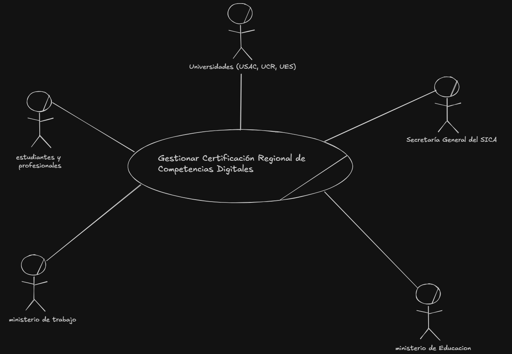

#### 1.2.2 Primera descomposición del Core (CDU de negocio)

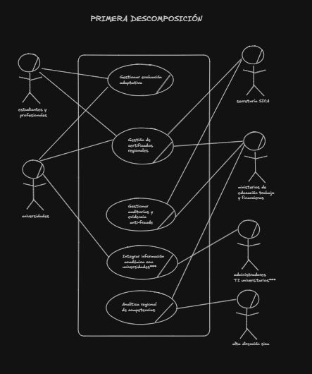
 
---
 
## 2. Características del sistema y Drivers Arquitectónicos

### 2.a Listado de drivers RF (Requerimientos Funcionales)

| ID | Driver RF | Fuente en el enunciado |
|---|---|---|
| RF-01 | El sistema debe soportar autenticación federada interactuando con protocolos dispares (LDAP, SAML, OAuth2) según la institución educativa. | debe soportar autenticación federada interactuando con protocolos dispares (LDAP, SAML, OAuth2 según la institución) |
| RF-02 | El sistema debe ingerir y exportar datos académicos en una variedad de formatos: JSON, XML y archivos planos CSV generados por sistemas heredados. | ser capaz de ingerir y exportar datos académicos en una variedad de formatos, que van desde flujos JSON o XML hasta la importación de archivos planos CSV |
| RF-03 | El núcleo de la plataforma debe ser un motor de exámenes adaptativos, donde la dificultad y el flujo de las preguntas se ajusten en tiempo real según la precisión de las respuestas previas del candidato. | un motor activo de evaluación mediante exámenes adaptativos, donde la dificultad de las preguntas cambia en tiempo real según las respuestas previas |
| RF-04 | El sistema debe capturar y almacenar evidencia concurrente para auditorías anti-fraude durante la evaluación, incluyendo capturas de pantalla, logs de tecleo y ráfagas de video ocasional. | debe capturar y almacenar evidencia concurrente para auditorías anti-fraude... telemetría variable como capturas de pantalla, logs de tecleo y ráfagas de video ocasional |
| RF-05 | El sistema debe analizar la evidencia capturada para detectar patrones de comportamiento que indiquen fraude académico o alteración de notas. | rastro de auditoría inmutable... que prevengan el fraude académico o la alteración de notas a nivel de base de datos |
| RF-06 | Los certificados digitales emitidos deben ser verificables criptográficamente, incorporando tecnologías de registros distribuidos (Blockchain/Hyperledger) o una Infraestructura de Llave Pública (PKI). | los certificados digitales emitidos deben ser verificables criptográficamente. La arquitectura deberá incorporar tecnologías de registros distribuidos, como redes Blockchain... o basarse en una Infraestructura de Llave Pública (PKI) |
| RF-07 | El sistema debe mantener una bitácora inmutable que demuestre que ni la calificación ni la identidad del portador han sido alteradas desde el momento de la emisión. | mantener una bitácora inmutable que demuestre que ni la calificación ni la identidad del portador han sido alteradas desde el momento de la emisión |
| RF-08 | Cada certificado emitido debe contar con un rastro de auditoría inmutable, respaldado por firmas electrónicas avanzadas. | los ministerios de trabajo y las direcciones financieras exigen que cada certificado emitido cuente con un rastro de auditoría inmutable, respaldado por firmas electrónicas avanzadas |
| RF-09 | El sistema debe gestionar el proceso de reintento de evaluación, considerando el siguiente período de certificación disponible (primera semana del mes siguiente). | estos períodos de certificación se habilitarán exclusivamente durante la primera semana de cada mes (implica reintentos sujetos al mismo calendario) |
| RF-10 | El sistema debe habilitar las evaluaciones de certificación exclusivamente durante la primera semana de cada mes. | el negocio dicta que estos períodos de certificación se habilitarán exclusivamente durante la primera semana de cada mes |
| RF-11 | El sistema debe permitir la consulta y verificación de certificados emitidos por parte de entidades externas (universidades, ministerios). | garantizar la validez jurídica transfronteriza de las competencias (requiere mecanismo de consulta/verificación externa) |
| RF-12 | El sistema debe permitir a auditores autorizados consultar la evidencia capturada por evaluación y generar reportes de auditoría. | garantizando que podamos auditar QUIÉN vio QUÉ dato y CUÁNDO, sin que nadie pueda evadirlo |
| RF-13 | Ante un caso de fraude confirmado, el sistema debe bloquear el certificado asociado y notificar a la Secretaría General del SICA. | prevengan el fraude académico + necesidad oculta de auditoría inobjetable (impacto arquitectónico derivado) |
| RF-14 | El sistema debe permitir a un titular ejercer su derecho al olvido, garantizando la anonimización o eliminación de sus datos personales conservando la trazabilidad legal del certificado. | cumplir simultáneamente con las leyes de protección de datos personales de diferentes países, garantizando el derecho al olvido |
| RF-15 | El sistema debe recibir notificaciones de cambio en el estado académico de un estudiante y evaluar su impacto sobre certificados vigentes. | Derivado de la interoperabilidad nativa con universidades y de la necesidad de mantener válidos solo los certificados correctos. |
| RF-16 | El sistema debe ejecutar un proceso de revocación de certificados, registrando la revocación de forma inmutable y notificando al titular. | Derivado de RF-07/RF-08 (bitácora inmutable) aplicado al ciclo de vida del certificado. |
| RF-17 | El sistema debe alimentar dashboards analíticos que permitan a la alta gerencia visualizar el estado de las competencias digitales segmentado por país, carrera universitaria y género. | el sistema debe alimentar dashboards analíticos que permitan a la alta gerencia visualizar el estado de las competencias digitales en la región, segmentando la información específicamente por país, carrera universitaria y género |
| RF-18 | La capa de datos debe ejecutar procesos rigurosos de agregación y anonimización antes de exponer las métricas a las interfaces gerenciales. | la capa de datos deberá ejecutar procesos rigurosos de agregación y anonimización antes de exponer las métricas a las interfaces gerenciales |
| RF-19 | El sistema debe transformar y normalizar los datos académicos recibidos de las universidades al modelo de datos interno de la plataforma. | Derivado de RF-02 (formatos dispares) y de la necesidad de un modelo unificado para evaluación y analítica. |
| RF-20 | El sistema debe registrar y notificar errores de integración con los sistemas universitarios al administrador TI correspondiente. | Derivado de cada institución opera como un silo tecnológico y de la necesidad operativa de soporte ante fallos de integración. |

---

### 2.b Listado de drivers EaC (Escenarios de Atributos de Calidad)

| ID | Atributo de Calidad | Descripción | Fuente en el enunciado |
|---|---|---|---|
| EaC-01 | Escalabilidad | El sistema debe soportar picos de tráfico agresivos con miles de usuarios simultáneos durante la primera semana de cada mes, sin degradación del servicio. | generará picos de tráfico agresivos con miles de usuarios simultáneos que el sistema debe soportar sin degradación del servicio |
| EaC-02 | Disponibilidad | El sistema debe mantenerse operativo durante los períodos de certificación, especialmente bajo los picos de carga concentrados. | Derivado del carácter urgente y masivo de los períodos de certificación. |
| EaC-03 | Interoperabilidad | El sistema debe integrarse nativamente con los sistemas heredados de al menos tres universidades pilares (USAC, UCR, UES), cada una con protocolos de autenticación distintos, sin obligarlas a cambiar su forma de trabajar. | diseñar una solución que se integre nativamente con los sistemas de al menos tres universidades pilares... sin obligar a las instituciones educativas a cambiar su forma de trabajar |
| EaC-04 | Rendimiento (autenticación) | La autenticación federada con las universidades debe resolverse en un tiempo que no retrase perceptiblemente el inicio de la evaluación. | Implícito en la necesidad de soportar miles de usuarios simultáneos al inicio de cada período. |
| EaC-05 | Interoperabilidad de datos | El sistema debe procesar datos académicos en formatos heterogéneos (JSON, XML, CSV) provenientes de sistemas más antiguos. | exponiendo o consumiendo datos en formatos totalmente dispares, desde JSON y XML hasta exportaciones manuales en archivos planos CSV |
| EaC-06 | Rendimiento (examen adaptativo) | El ajuste de dificultad del examen debe calcularse en tiempo real, sin demoras perceptibles entre preguntas. | la dificultad de las preguntas cambia en tiempo real según las respuestas previas del usuario |
| EaC-07 | Seguridad | El sistema debe garantizar la encriptación de datos sensibles en reposo y en tránsito, y restringir el acceso a evidencia biométrica y de comportamiento. | garantizando el derecho al olvido y la encriptación de datos sensibles en reposo y en tránsito |
| EaC-08 | Durabilidad / Persistencia | La evidencia de evaluación (telemetría, capturas, video) debe conservarse de forma inalterable durante un período de 5 años. | garantizando una retención inalterable por un período de 5 años para cumplir con el GDPR y legislaciones locales |
| EaC-09 | Eficiencia de costos (almacenamiento) | El almacenamiento de la evidencia biométrica y de comportamiento debe ser altamente seguro y optimizado en costos, dada su alta volumetría. | exigirá un almacenamiento altamente seguro y optimizado en costos |
| EaC-10 | Rendimiento (detección de fraude) | La detección de patrones sospechosos debe ejecutarse durante la evaluación sin interrumpir la experiencia del candidato. | Derivado de evidencia concurrente para auditorías anti-fraude durante la evaluación. |
| EaC-11 | Integridad | Los certificados, reportes de auditoría y revocaciones deben permanecer inalterables desde su emisión/registro. | mantener una bitácora inmutable que demuestre que ni la calificación ni la identidad del portador han sido alteradas |
| EaC-12 | Verificabilidad | Cualquier entidad autorizada debe poder verificar la validez de un certificado de forma rápida y confiable. | garantizar la validez jurídica transfronteriza de las competencias |
| EaC-13 | Confiabilidad | Las sincronizaciones de datos académicos no deben perder información ni generar duplicados ante reintentos o fallos parciales. | Derivado de la heterogeneidad de los sistemas universitarios y la tolerancia a fallos exigida. |
| EaC-14 | Trazabilidad | El sistema debe permitir auditar quién accedió a qué dato, cuándo y con qué propósito, sin posibilidad de evasión. | garantizando que podamos auditar QUIÉN vio QUÉ dato y CUÁNDO, sin que nadie pueda evadirlo |
| EaC-15 | Privacidad | Los datos personales deben anonimizarse y agregarse antes de su exposición en dashboards, y debe respetarse el derecho al olvido sin romper la cadena de auditoría. | la capa de datos deberá ejecutar procesos rigurosos de agregación y anonimización antes de exponer las métricas |
| EaC-16 | Tolerancia a fallos | El sistema debe operar de forma confiable ante la heterogeneidad y posibles fallos de los sistemas universitarios externos. | Derivado de cada institución opera como un silo tecnológico con ecosistema altamente fragmentado. |
| EaC-17 | Rendimiento de analítica | La generación de reportes y dashboards analíticos no debe afectar el rendimiento de las operaciones transaccionales de evaluación. | Derivado de la necesidad de separar el comportamiento transaccional (evaluación) del analítico (dashboards). |
| EaC-18 | Usabilidad | Los dashboards analíticos deben ser comprensibles para la alta gerencia, sin requerir conocimiento técnico. | permitan a la alta gerencia visualizar el estado de las competencias digitales en la región |
| EaC-19 | Modificabilidad / Extensibilidad | La arquitectura debe permitir incorporar nuevas universidades, protocolos o tipos de certificación sin rediseño completo. | Derivado del carácter regional y de crecimiento esperado del SICA (3+ universidades pilares, al menos). |

---

### 2.c Listado de drivers de Restricción (tecnológicos, normativos y operativos)

| ID | Tipo | Descripción | Fuente en el enunciado |
|---|---|---|---|
| RES-01 | Operativa | Los períodos de certificación se habilitan exclusivamente durante la primera semana de cada mes. | el negocio dicta que estos períodos de certificación se habilitarán exclusivamente durante la primera semana de cada mes |
| RES-02 | Presupuesto | El presupuesto máximo aprobado para el piloto es de USD 180,000, incluyendo cómputo, almacenamiento, transferencia y servicios gestionados. | La dirección financiera ha aprobado un presupuesto máximo de USD 180,000 para el piloto |
| RES-03 | Tecnológica | Cada universidad pilar (USAC, UCR, UES) opera con un protocolo de autenticación distinto (LDAP, SAML, OAuth2). | poseyendo distintos protocolos de autenticación (LDAP, SAML, OAuth2) |
| RES-04 | Normativa | La plataforma debe cumplir simultáneamente con las leyes de protección de datos personales de distintos países, incluyendo el derecho al olvido. | deberá cumplir simultáneamente con las leyes de protección de datos personales de diferentes países, garantizando el derecho al olvido |
| RES-05 | Tecnológica | Los formatos de intercambio de datos académicos son heterogéneos: JSON, XML y archivos planos CSV de sistemas más antiguos. | exponiendo o consumiendo datos en formatos totalmente dispares, desde JSON y XML hasta exportaciones manuales en archivos planos CSV |
| RES-06 | Normativa | La plataforma debe cumplir con el GDPR y con legislaciones locales como la Ley de Acceso a la Información Pública de Guatemala. | garantizando una retención inalterable por un período de 5 años para cumplir con el GDPR y legislaciones locales como la Ley de Acceso a la Información Pública de Guatemala |
| RES-07 | Tecnológica / Económica | Debe priorizarse el uso de tecnologías Open Source para optimizar costos de licenciamiento. | obligando a priorizar el uso de tecnologías Open Source y a optimizar los costos de licenciamiento |
| RES-08 | Normativa | Los certificados deben tener validez jurídica transfronteriza dentro de los países que conforman el SICA. | garantizar la validez jurídica transfronteriza de las competencias |
| RES-09 | Normativa | Cada certificado y cada acción de auditoría debe respaldarse con firmas electrónicas avanzadas y registrarse en una bitácora inmutable. | respaldado por firmas electrónicas avanzadas que prevengan el fraude académico o la alteración de notas |
| RES-10 | Normativa | Los datos sensibles deben encriptarse tanto en reposo como en tránsito. | la encriptación de datos sensibles en reposo y en tránsito |
| RES-11 | Tecnológica / Operativa | La primera versión del sistema debe desplegarse on-premise, reutilizando servidores físicos e infraestructura existente del SICA, pero preparada para una migración transparente a la nube en fases posteriores. | la primera versión del sistema debe desplegarse en soluciones on-premise, reutilizando servidores físicos e infraestructura existente del SICA... la arquitectura diseñada debe estar intrínsecamente preparada para una migración transparente hacia la nube |
| RES-12 | Temporal | La primera versión arquitectónica debe quedar completamente definida, justificada y documentada en un plazo máximo de tres a cuatro semanas. | la presión política exige que la primera versión arquitectónica esté completamente definida, justificada y documentada en un plazo máximo de tres a cuatro semanas |
| RES-13 | Operativa | El SICA cuenta con capacidades técnicas heterogéneas, personal de soporte limitado y un ecosistema de software base altamente fragmentado. | el SICA no es un gigante tecnológico; es una entidad regional con capacidades técnicas heterogéneas, personal de soporte limitado y un ecosistema de software base altamente fragmentado |

---

### 2.d Descripción de características principales de la PRCCD (priorizadas por impacto en el negocio)

| Prioridad | Característica | Justificación del impacto en el negocio |
|---|---|---|
| 1 | **Motor de evaluación adaptativa con captura de evidencia anti-fraude** | Es el núcleo operativo descrito en el enunciado (no será un simple repositorio de diplomas, sino un motor activo de evaluación). Sin esto no hay producto: es lo que diferencia al PRCCD de un sistema de certificación tradicional y es donde se concentra el pico de carga del negocio (miles de usuarios en la primera semana de cada mes). |
| 2 | **Certificación digital con validez jurídica transfronteriza (criptográfica e inmutable)** | Es la promesa de valor regional del SICA: sin validez transfronteriza verificable, el certificado no vale más que una imagen. Es exigido simultáneamente por ministerios de trabajo, direcciones financieras y por la necesidad de unificar la región. |
| 3 | **Interoperabilidad con sistemas heredados de las universidades (autenticación federada y formatos dispares)** | Es la condición sin la cual el SICA no logra su objetivo político de unificar la región sin obligar a las instituciones a cambiar su forma de trabajar. Es también el mayor riesgo técnico identificado explícitamente (cada institución opera como un silo tecnológico). |
| 4 | **Cumplimiento normativo multinacional (protección de datos, derecho al olvido, encriptación, auditoría inmutable)** | Es un imperativo estricto declarado por el enunciado para una entidad que actúa a nivel multinacional; su incumplimiento implica riesgo legal y penal explícito, por lo que condiciona el diseño de toda la capa de datos. |
| 5 | **Analítica regional con datos agregados y anonimizados para la toma de decisiones** | Es el valor estratégico de la plataforma para los ministerios de educación y trabajo (inteligencia de negocio). Tiene menor urgencia operativa que las anteriores (puede ejecutarse de forma diferida/batch), pero es la razón por la que la alta dirección política impulsa el proyecto. |
| 6 | **Despliegue on-premise con preparación para migración a la nube, bajo presupuesto Open Source de USD 180,000** | Condiciona TODAS las decisiones tecnológicas anteriores, pero no es una característica de negocio en sí misma — es la restricción de viabilidad bajo la cual deben implementarse las características 1 a 5. |

---
 
## 3. Diagramas de CDU Expandidos

### 3.a Diagrama de casos de uso expandidos del sistema

#### Vista general — Diagrama de CDU Expandidos

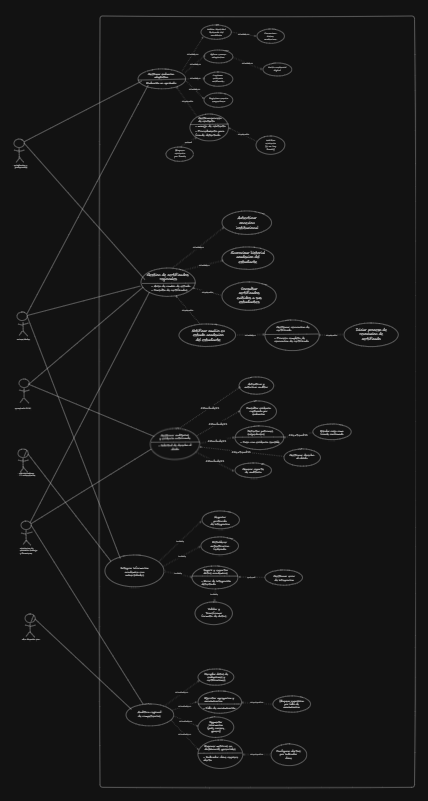

---

#### CUN: Gestionar Evaluación Adaptativa


---

#### CUN: Gestión de Certificados Regionales

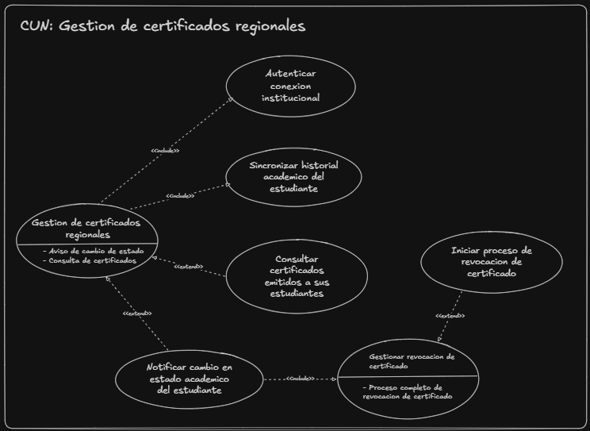

---

#### CUN: Gestionar Auditorías y Evidencia Anti-fraude

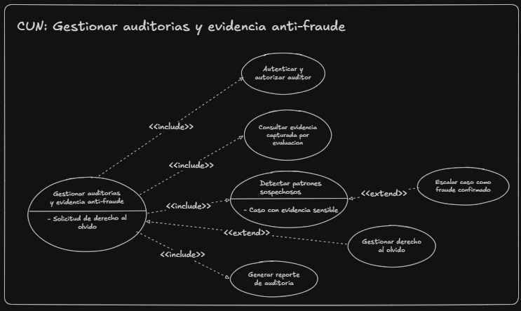

---

#### CUN: Integrar Información Académica con Universidades

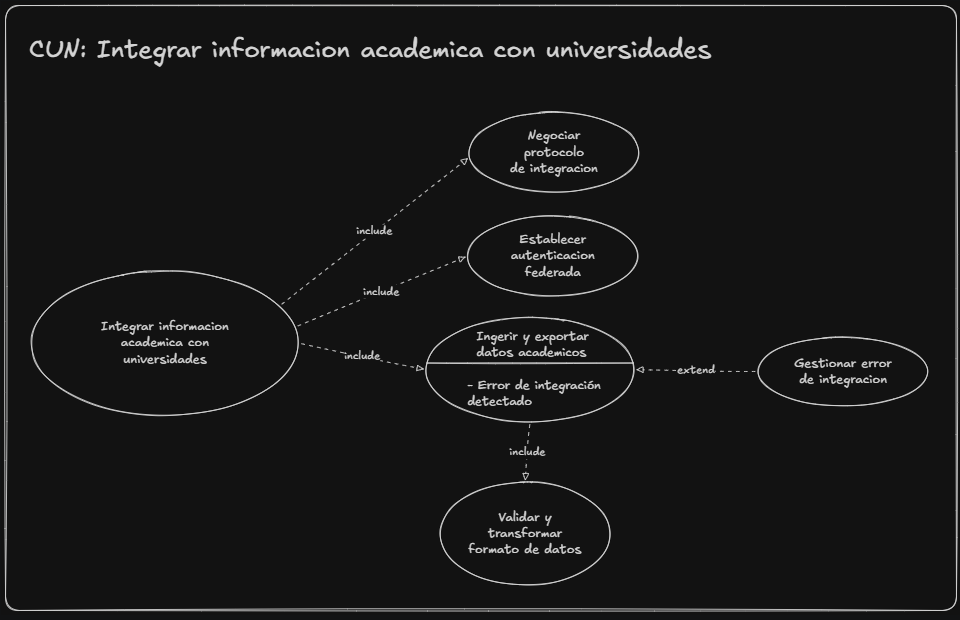

---

#### CUN: Analítica Regional de Competencias

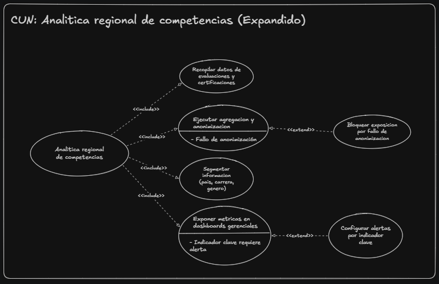

---

### 3.c Descripciones textuales de CDU (Primera Descomposición)

#### CDU-01 — Gestionar evaluación adaptativa


---

#### CDU-02 — Gestión de certificados regionales


---

#### CDU-03 — Gestionar auditorías y evidencia anti-fraude


---

### 3.b Detalle de drivers RF, EaC y de Restricción asociados a cada CDU

---

#### Expandido 1: Gestionar evaluación adaptativa

##### CDUE-00 — Gestionar evaluación adaptativa (CDU base)

**Drivers RF:**
- RF-03: Motor de exámenes adaptativos con ajuste de dificultad en tiempo real.
- RF-10: Habilitación de evaluaciones exclusivamente en la primera semana de cada mes.

**Drivers EaC:**
- EaC-01: Escalabilidad — soportar miles de usuarios simultáneos durante la primera semana de cada mes sin degradación del servicio.
- EaC-02: Disponibilidad — el sistema debe mantenerse operativo durante los períodos de certificación sin interrupciones.

**Drivers de Restricción:**
- RES-01: (Operativa) Las evaluaciones solo se habilitan la primera semana de cada mes (regla de negocio del SICA).
- RES-02: (Presupuesto) Presupuesto máximo de USD 180,000 para el piloto.

---

##### CDUE-01 — Validar identidad federada del candidato

**Drivers RF:**
- RF-01: Autenticación federada multi-protocolo (LDAP, SAML, OAuth2) con las universidades pilares.
- RF-02: Sincronización e ingesta de datos académicos en formatos dispares (JSON, XML, CSV).

**Drivers EaC:**
- EaC-03: Interoperabilidad — interactuar con protocolos dispares sin requerir que las universidades cambien su forma de trabajar.
- EaC-04: Rendimiento (autenticación) — la autenticación debe completarse en pocos segundos.

**Drivers de Restricción:**
- RES-03: (Tecnológica) Cada universidad pilar usa un protocolo distinto (USAC: LDAP, UCR: SAML, UES: OAuth2).
- RES-04: (Normativa) Cumplimiento con leyes de protección de datos personales de cada país al transmitir credenciales.

---

##### CDUE-02 — Sincronizar datos académicos

**Drivers RF:**
- RF-02: Sincronización e ingesta de datos académicos en formatos dispares (JSON, XML, CSV).
- RF-19: Transformación y normalización de datos académicos al modelo interno de la plataforma.

**Drivers EaC:**
- EaC-05: Interoperabilidad (datos) — procesar desde APIs modernas (JSON) hasta exportaciones manuales (CSV).

**Drivers de Restricción:**
- RES-05: (Tecnológica) Los datos académicos de las universidades vienen en formatos heterogéneos.

---

##### CDUE-03 — Aplicar examen adaptativo

**Drivers RF:**
- RF-03: Motor de exámenes adaptativos con ajuste de dificultad en tiempo real.

**Drivers EaC:**
- EaC-06: Rendimiento (examen) — el ajuste de dificultad debe calcularse en tiempo real sin demora perceptible entre preguntas.
- EaC-01: Escalabilidad — soportar miles de evaluaciones concurrentes durante los picos.

**Drivers de Restricción:**
- (Ninguna restricción adicional específica a este CDU.)

---

##### CDUE-04 — Capturar evidencia antifraude

**Drivers RF:**
- RF-04: Captura concurrente de evidencia antifraude (pantalla, logs de tecleo, ráfagas de video).

**Drivers EaC:**
- EaC-07: Seguridad — la evidencia biométrica y de comportamiento debe almacenarse de forma altamente segura.
- EaC-08: Durabilidad / Persistencia — retención inalterable por un período de 5 años.
- EaC-09: Eficiencia de costos — almacenamiento optimizado en costos dada la alta volumetría.

**Drivers de Restricción:**
- RES-06: (Normativa) Cumplir con el GDPR y con la Ley de Acceso a la Información Pública de Guatemala.
- RES-07: (Tecnológica) Priorizar tecnologías Open Source para optimizar costos de licenciamiento.

---

##### CDUE-05 — Registrar evento sospechoso

**Drivers RF:**
- RF-05: Detección de patrones de comportamiento sospechoso durante la evaluación.

**Drivers EaC:**
- EaC-10: Rendimiento (detección) — la detección debe ejecutarse en tiempo real sin interrumpir la evaluación en curso.

**Drivers de Restricción:**
- (Ninguna restricción adicional específica.)

---

##### CDUE-06 — Emitir credencial digital

**Drivers RF:**
- RF-06: Emisión de certificados digitales verificables criptográficamente (PKI / blockchain).
- RF-07: Registro en bitácora inmutable.
- RF-08: Firma electrónica avanzada en certificados.

**Drivers EaC:**
- EaC-11: Integridad — garantizar que ni la calificación ni la identidad del portador puedan alterarse.
- EaC-12: Verificabilidad — cualquier entidad debe poder verificar un certificado en pocos segundos.

**Drivers de Restricción:**
- RES-08: (Normativa) Los certificados deben tener validez jurídica transfronteriza dentro de los países del SICA.
- RES-09: (Normativa) Rastro de auditoría inmutable respaldado por firmas electrónicas avanzadas.

---

##### CDUE-07 — Gestionar proceso de reintento

**Drivers RF:**
- RF-09: Gestión de proceso de reintento (notificación, habilitación o bloqueo).

**Drivers EaC:**
- (Ningún EaC crítico adicional específico.)

**Drivers de Restricción:**
- RES-01: (Operativa) Los reintentos solo pueden ocurrir en la primera semana del siguiente mes.

---

##### CDUE-08 — Bloquear reintento por fraude

**Drivers RF:**
- RF-09: Gestión de proceso de reintento (notificación, habilitación o bloqueo).
- RF-13: Escalamiento de caso por fraude confirmado (bloqueo de certificado + notificación a Secretaría SICA).

**Drivers EaC:**
- EaC-07: Seguridad — el bloqueo debe aplicarse de forma inmediata e inviolable.

**Drivers de Restricción:**
- (Ninguna restricción adicional específica.)

---

##### CDUE-09 — Habilitar reintento (si no hay fraude)

**Drivers RF:**
- RF-09: Gestión de proceso de reintento (notificación, habilitación o bloqueo).

**Drivers EaC:**
- (Ningún EaC crítico adicional específico.)

**Drivers de Restricción:**
- RES-01: (Operativa) La habilitación debe quedar registrada antes de la apertura del siguiente período.

---

#### Expandido 2: Gestión de certificados regionales

##### CDUE-10 — Gestión de certificados regionales (CDU base)

**Drivers RF:**
- RF-06: Emisión de certificados digitales verificables criptográficamente (PKI / blockchain).
- RF-11: Consulta y verificación de autenticidad de certificados emitidos.

**Drivers EaC:**
- EaC-11: Integridad — los certificados no pueden alterarse después de emitidos.
- EaC-12: Verificabilidad — respuesta de validación en pocos segundos.

**Drivers de Restricción:**
- RES-08: (Normativa) Validez jurídica transfronteriza.
- RES-09: (Normativa) Rastro de auditoría inmutable con firmas electrónicas avanzadas.

---

##### CDUE-11 — Autenticar conexión institucional

**Drivers RF:**
- RF-01: Autenticación federada multi-protocolo (LDAP, SAML, OAuth2).

**Drivers EaC:**
- EaC-03: Interoperabilidad — soportar los diferentes protocolos de cada institución.
- EaC-07: Seguridad — garantizar que solo entidades autorizadas accedan a la información.

**Drivers de Restricción:**
- RES-03: (Tecnológica) Protocolos heterogéneos (LDAP, SAML, OAuth2).

---

##### CDUE-12 — Sincronizar historial académico del estudiante

**Drivers RF:**
- RF-02: Sincronización e ingesta de datos académicos en formatos dispares (JSON, XML, CSV).
- RF-19: Transformación y normalización de datos académicos al modelo interno.

**Drivers EaC:**
- EaC-05: Interoperabilidad (datos) — formatos dispares.

**Drivers de Restricción:**
- RES-05: (Tecnológica) Formatos heterogéneos de datos académicos.

---

##### CDUE-13 — Consultar certificados emitidos a sus estudiantes

**Drivers RF:**
- RF-11: Consulta y verificación de autenticidad de certificados emitidos.

**Drivers EaC:**
- EaC-12: Verificabilidad — respuesta rápida.
- EaC-07: Seguridad — aislamiento de datos por institución.

**Drivers de Restricción:**
- RES-04: (Normativa) Protección de datos personales; aislamiento por institución.

---

##### CDUE-14 — Notificar cambio en estado académico del estudiante

**Drivers RF:**
- RF-15: Notificación de cambio en estado académico y evaluación de impacto sobre certificados vigentes.

**Drivers EaC:**
- EaC-13: Confiabilidad — los cambios no deben perderse ni procesarse duplicados.

**Drivers de Restricción:**
- (Ninguna restricción adicional específica.)

---

##### CDUE-15 — Gestionar revocación de certificado

**Drivers RF:**
- RF-06: Emisión de certificados digitales verificables criptográficamente (gestión del ciclo de vida).
- RF-15: Notificación de cambio en estado académico y evaluación de impacto.

**Drivers EaC:**
- EaC-11: Integridad — la revocación debe registrarse en la bitácora inmutable.

**Drivers de Restricción:**
- RES-09: (Normativa) El rastro de revocación debe ser inalterable.

---

##### CDUE-16 — Iniciar proceso de revocación de certificado

**Drivers RF:**
- RF-16: Proceso de revocación de certificado con registro inmutable y notificación al titular.
- RF-07: Registro en bitácora inmutable.
- RF-08: Firma electrónica avanzada.

**Drivers EaC:**
- EaC-11: Integridad — la revocación queda registrada inmutablemente.
- EaC-14: Trazabilidad — auditar quién, cuándo y por qué se revocó.

**Drivers de Restricción:**
- RES-09: (Normativa) Firmas electrónicas avanzadas en el registro de revocación.

---

#### Expandido 3: Gestionar auditorías y evidencia anti-fraude

##### CDUE-17 — Gestionar auditorías y evidencia anti-fraude (CDU base)

**Drivers RF:**
- RF-12: Gestión de auditorías con consulta de evidencia y generación de reportes inmutables.

**Drivers EaC:**
- EaC-14: Trazabilidad — auditar quién vio qué dato y cuándo, sin que nadie pueda evadirlo.
- EaC-08: Durabilidad — retención de evidencia por 5 años.

**Drivers de Restricción:**
- RES-06: (Normativa) GDPR y Ley de Acceso a la Información Pública de Guatemala.

---

##### CDUE-18 — Autenticar y autorizar auditor

**Drivers RF:**
- RF-01: Autenticación federada multi-protocolo (aplicada al rol de auditor).

**Drivers EaC:**
- EaC-07: Seguridad — solo personal autorizado puede acceder a evidencia sensible.

**Drivers de Restricción:**
- (Ninguna restricción adicional específica.)

---

##### CDUE-19 — Consultar evidencia capturada por evaluación

**Drivers RF:**
- RF-12: Gestión de auditorías con consulta de evidencia y generación de reportes inmutables.

**Drivers EaC:**
- EaC-08: Durabilidad — evidencia inalterable por 5 años.
- EaC-11: Integridad — verificar que la evidencia no ha sido modificada desde su captura.

**Drivers de Restricción:**
- RES-06: (Normativa) Retención conforme a GDPR y legislación local.

---

##### CDUE-20 — Detectar patrones sospechosos

**Drivers RF:**
- RF-05: Detección de patrones de comportamiento sospechoso.

**Drivers EaC:**
- EaC-10: Rendimiento (detección) — el análisis debe ser eficiente.

**Drivers de Restricción:**
- (Ninguna restricción adicional específica.)

---

##### CDUE-21 — Generar reporte de auditoría

**Drivers RF:**
- RF-12: Gestión de auditorías con consulta de evidencia y generación de reportes inmutables.
- RF-07: Registro en bitácora inmutable.
- RF-08: Firma electrónica avanzada en reportes.

**Drivers EaC:**
- EaC-14: Trazabilidad — cada reporte debe ser rastreable e inalterable.
- EaC-11: Integridad — la firma electrónica previene alteraciones.

**Drivers de Restricción:**
- RES-09: (Normativa) Firmas electrónicas avanzadas obligatorias en reportes de auditoría.

---

##### CDUE-22 — Escalar caso como fraude confirmado

**Drivers RF:**
- RF-13: Escalamiento de caso por fraude confirmado (bloqueo de certificado + notificación a Secretaría SICA).
- RF-07: Registro en bitácora inmutable.

**Drivers EaC:**
- EaC-07: Seguridad — el bloqueo debe ser inmediato e irreversible hasta resolución.

**Drivers de Restricción:**
- RES-09: (Normativa) El bloqueo y la notificación deben quedar registrados inmutablemente.

---

##### CDUE-23 — Gestionar derecho al olvido

**Drivers RF:**
- RF-14: Gestión del derecho al olvido (anonimización/eliminación conservando trazabilidad legal).

**Drivers EaC:**
- EaC-15: Privacidad — garantizar el derecho al olvido sin romper la cadena de auditoría.
- EaC-07: Seguridad — encriptación de datos sensibles en reposo y en tránsito.

**Drivers de Restricción:**
- RES-06: (Normativa) GDPR (derecho al olvido) y leyes locales de protección de datos.
- RES-10: (Normativa) Encriptación de datos sensibles en reposo y en tránsito.

---

#### Expandido 4: Integrar información académica con universidades

##### CDUE-24 — Integrar información académica con universidades (CDU base)

**Drivers RF:**
- RF-01: Autenticación federada multi-protocolo (LDAP, SAML, OAuth2).
- RF-02: Sincronización e ingesta de datos académicos en formatos dispares (JSON, XML, CSV).

**Drivers EaC:**
- EaC-03: Interoperabilidad — integración sin que las universidades cambien su forma de trabajar.
- EaC-16: Tolerancia a fallos — tolerar fallos temporales de red en las integraciones sin perder datos.

**Drivers de Restricción:**
- RES-03: (Tecnológica) Protocolos heterogéneos (LDAP, SAML, OAuth2).
- RES-05: (Tecnológica) Formatos de datos dispares (JSON, XML, CSV).

---

##### CDUE-25 — Negociar protocolo de integración

**Drivers RF:**
- RF-01: Autenticación federada multi-protocolo (detección automática del protocolo de cada universidad).

**Drivers EaC:**
- EaC-03: Interoperabilidad — manejar múltiples protocolos de forma transparente.

**Drivers de Restricción:**
- RES-03: (Tecnológica) Cada universidad usa un protocolo distinto.

---

##### CDUE-26 — Establecer autenticación federada

**Drivers RF:**
- RF-01: Autenticación federada multi-protocolo.

**Drivers EaC:**
- EaC-04: Rendimiento (autenticación) — la autenticación no debe retrasar el flujo.
- EaC-07: Seguridad — transmisión segura de credenciales entre sistemas.

**Drivers de Restricción:**
- RES-04: (Normativa) Protección de datos personales al transmitir credenciales entre países.

---

##### CDUE-27 — Ingerir y exportar datos académicos

**Drivers RF:**
- RF-02: Sincronización e ingesta de datos académicos en formatos dispares (JSON, XML, CSV).

**Drivers EaC:**
- EaC-05: Interoperabilidad (datos) — procesar desde APIs modernas hasta exportaciones CSV manuales.

**Drivers de Restricción:**
- RES-05: (Tecnológica) Formatos heterogéneos.

---

##### CDUE-28 — Validar y transformar formato de datos

**Drivers RF:**
- RF-19: Transformación y normalización de datos académicos al modelo interno de la plataforma.

**Drivers EaC:**
- EaC-13: Confiabilidad — rechazar datos malformados sin perder los válidos.

**Drivers de Restricción:**
- (Ninguna restricción adicional específica.)

---

##### CDUE-29 — Gestionar error de integración

**Drivers RF:**
- RF-20: Gestión de errores de integración con notificación al administrador TI universitario.

**Drivers EaC:**
- EaC-16: Tolerancia a fallos — los errores de integración no deben tumbar el sistema ni perder datos.

**Drivers de Restricción:**
- (Ninguna restricción adicional específica.)

---

#### Expandido 5: Analítica regional de competencias

##### CDUE-30 — Analítica regional de competencias (CDU base)

**Drivers RF:**
- RF-17: Dashboards analíticos con métricas segmentadas por país, carrera y género.
- RF-18: Agregación y anonimización de datos antes de exposición a interfaces gerenciales.

**Drivers EaC:**
- EaC-15: Privacidad — los datos deben pasar por agregación y anonimización antes de exponerse.
- EaC-17: Rendimiento (analítica) — la ejecución no debe afectar el rendimiento de las operaciones transaccionales.

**Drivers de Restricción:**
- RES-06: (Normativa) Cumplimiento con leyes de protección de datos de múltiples países.

---

##### CDUE-31 — Recopilar datos de evaluaciones y certificaciones

**Drivers RF:**
- RF-17: Dashboards analíticos con métricas segmentadas (la recopilación es el insumo).

**Drivers EaC:**
- EaC-17: Rendimiento (analítica) — la recopilación no debe impactar las operaciones transaccionales (separación OLTP/OLAP).

**Drivers de Restricción:**
- (Ninguna restricción adicional específica.)

---

##### CDUE-32 — Ejecutar agregación y anonimización

**Drivers RF:**
- RF-18: Agregación y anonimización de datos antes de exposición a interfaces gerenciales.

**Drivers EaC:**
- EaC-15: Privacidad — ningún dato personal identificable puede llegar a los dashboards.

**Drivers de Restricción:**
- RES-06: (Normativa) GDPR y leyes locales de protección de datos.

---

##### CDUE-33 — Segmentar información (país, carrera, género)

**Drivers RF:**
- RF-17: Dashboards analíticos con métricas segmentadas por país, carrera y género.

**Drivers EaC:**
- (Ningún EaC adicional específico.)

**Drivers de Restricción:**
- (Ninguna restricción adicional específica.)

---

##### CDUE-34 — Exponer métricas en dashboards gerenciales

**Drivers RF:**
- RF-17: Dashboards analíticos con métricas segmentadas por país, carrera y género.

**Drivers EaC:**
- EaC-18: Usabilidad — los dashboards deben ser intuitivos para la alta gerencia.

**Drivers de Restricción:**
- (Ninguna restricción adicional específica.)

---

##### CDUE-35 — Bloquear exposición por fallo de anonimización

**Drivers RF:**
- RF-18: Agregación y anonimización de datos antes de exposición (rama de fallo).

**Drivers EaC:**
- EaC-15: Privacidad — protección ante fallos del proceso de anonimización.

**Drivers de Restricción:**
- RES-06: (Normativa) Infringir la normativa acarrea sanciones legales.

---

##### CDUE-36 — Configurar alertas por indicador clave

**Drivers RF:**
- RF-17: Dashboards analíticos con métricas segmentadas (extensión de alertas).

**Drivers EaC:**
- (Ningún EaC adicional específico.)

**Drivers de Restricción:**
- (Ninguna restricción adicional específica.)

---
 
## 4. Matrices de Trazabilidad
 
### 4.a Stakeholders vs. Requerimientos
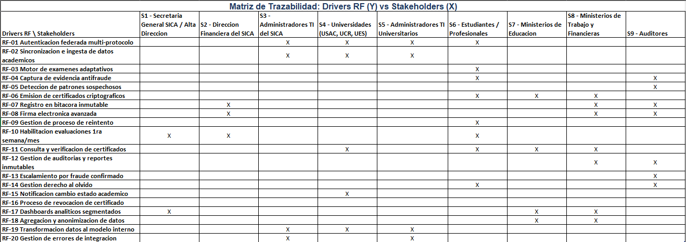
 
### 4.b Stakeholders vs. CDU
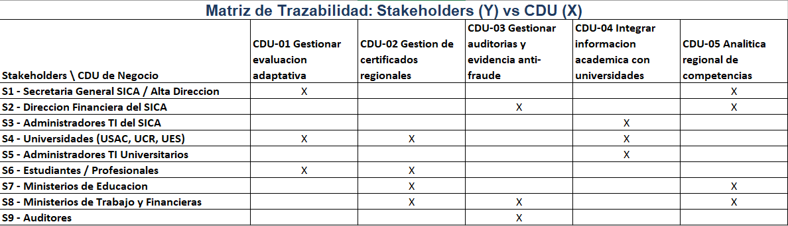
 
### 4.c Requerimiento vs. CDU
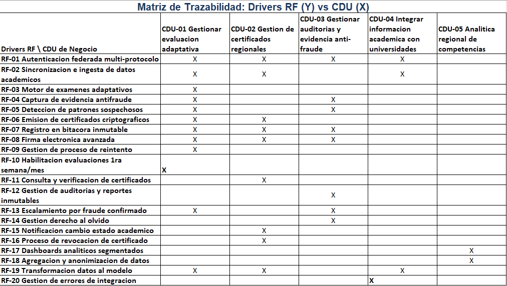
 
---
 
## 5. Selección Arquitectónica
 
### 5.1 Estilo(s) arquitectónico(s) seleccionado(s)
## Estilo principal: Arquitectura en Capas (Layered) combinada con Orientación a Servicios (SOA)

Para el PRCCD se selecciona como estilo principal la **arquitectura en capas**, sobre la cual se implementa un **enfoque orientado a servicios (SOA)** para los módulos que corresponden a procesos de negocio independientes. Esta combinación es coherente porque, como se vio en el curso, SOA no es un estilo que "viene solo": se implementa sobre una base de capas, donde aparece una capa de servicios adicional entre la lógica de negocio y la presentación.

La estructura general queda así:

- **Capa de presentación**: portal web para administradores/auditores del SICA, portal de consulta para universidades y ministerios, y la interfaz de evaluación para estudiantes/profesionales.
- **Capa de servicios (SOA)**: cada proceso de negocio de la primera descomposición se expone como un servicio independiente: Servicio de Evaluación Adaptativa, Servicio de Certificación Regional, Servicio de Auditoría Anti-fraude, Servicio de Integración Académica y Servicio de Analítica Regional.
- **Capa de lógica de negocio**: reglas de negocio de cada servicio (motor adaptativo, motor de emisión criptográfica, motor de detección de fraude, etc.).
- **Capa de integración**: pasarelas que traducen entre los protocolos de autenticación (LDAP, SAML, OAuth2) y formatos de datos (JSON, XML, CSV) de cada universidad hacia el formato interno de la plataforma.
- **Capa de datos**: bases de datos transaccionales (OLTP) para evaluación y certificación, almacenamiento de evidencia (optimizado en costos), y un repositorio analítico (OLAP) separado para los dashboards regionales.

## Estilo complementario: Basado en eventos (Event-Driven), para los flujos asíncronos

Se incorpora un componente basado en eventos para los flujos que no requieren respuesta inmediata y que deben tolerar fallos:

- Captura y envío de evidencia anti-fraude (telemetría) hacia el almacenamiento seguro.
- Notificaciones de cambio de estado académico desde las universidades hacia el módulo de certificados.
- Registro de certificados y revocaciones en la red de blockchain/PKI.
- Alimentación del repositorio analítico (ETL hacia la capa OLAP).

Estos estilos pueden coexistir porque técnicamente son compatibles: el bus de eventos se ubica entre la capa de servicios y la capa de datos, sin romper la separación por capas ni la independencia de los servicios.
 
### 5.2 Argumentación técnica y económica
## Argumentación técnica
La elección responde directamente a los drivers identificados a partir del enunciado:

**Correspondencia servicio-proceso de negocio.** Cada uno de los cinco procesos de negocio de la primera descomposición (evaluación adaptativa, certificación regional, auditoría anti-fraude, integración académica, analítica regional) se traduce en un servicio independiente. Esto permite hacer ingeniería inversa desde el despliegue hasta los casos de uso de negocio, lo cual es la prueba de que el estilo SOA está correctamente implementado.

**Aislamiento de fallos por capas e integración.** El requerimiento de tolerancia a fallos en las integraciones con universidades (RES-03, RES-05, EaC-16) se resuelve aislando toda la complejidad de protocolos y formatos en la capa de integración, sin que un fallo en una universidad afecte al resto del sistema.

**Escalabilidad concentrada en el servicio correcto.** El pico de tráfico de la primera semana de cada mes (EaC-01) afecta principalmente al Servicio de Evaluación Adaptativa. Con servicios independientes, este componente puede escalarse de forma aislada (más instancias, más recursos) sin necesidad de escalar toda la plataforma, lo cual es clave bajo un presupuesto limitado.

**Separación OLTP/OLAP para la analítica.** El requerimiento de que la analítica no afecte el rendimiento transaccional (EaC-17) se resuelve de forma natural separando el repositorio analítico de la capa de datos transaccional, alimentado mediante eventos.

**Modificabilidad para crecimiento regional.** El requerimiento implícito de incorporar nuevas universidades o tipos de certificación sin rediseño completo (EaC-19) se resuelve porque agregar una nueva universidad implica únicamente agregar un adaptador en la capa de integración, y agregar un nuevo tipo de certificación implica un nuevo servicio, sin tocar los servicios existentes.

**Preparación para migración a la nube.** La restricción de iniciar on-premise pero migrar a la nube en fases posteriores (RES-11) se resuelve porque la separación en capas y servicios permite migrar un servicio a la vez (por ejemplo, primero el repositorio analítico OLAP a la nube, manteniendo el resto on-premise), sin requerir un "big bang" de migración.

## Argumentación económica

**Aprovechamiento de infraestructura existente.** Al ser on-premise en su primera versión (RES-11), la arquitectura en capas permite distribuir los servicios sobre los servidores físicos existentes del SICA sin necesidad de inversión adicional en infraestructura para el piloto.

**Reducción de costos de licenciamiento.** La capa de integración y los servicios pueden construirse sobre tecnologías Open Source (RES-07): por ejemplo, un bus de mensajería open source para el componente basado en eventos, motores de bases de datos open source para OLTP y OLAP, y librerías open source de PKI para la firma electrónica de certificados, evitando licenciamiento costoso de plataformas SOA propietarias.

**Optimización del almacenamiento de evidencia.** Separar la evidencia anti-fraude (alta volumetría, retención de 5 años) en un almacenamiento propio dentro de la capa de datos permite aplicar políticas de almacenamiento en frío u optimizado en costos (EaC-09), sin que esa volumetría incremente el costo del almacenamiento transaccional principal.

**Escalamiento bajo demanda con control de presupuesto.** Al concentrar la escalabilidad en el Servicio de Evaluación Adaptativa, los recursos adicionales solo se requieren durante la primera semana de cada mes, lo que permite planificar el presupuesto de USD 180,000 alrededor de picos predecibles en lugar de sobredimensionar toda la plataforma de forma permanente.

**Viabilidad del equipo de desarrollo.** La separación en servicios independientes por capas permite que equipos pequeños trabajen en paralelo sobre módulos acotados (evaluación, certificación, auditoría, integración, analítica), lo cual es coherente con la realidad operativa descrita: "personal de soporte limitado" y capacidades técnicas heterogéneas.

---

## Conclusión de la selección

La combinación de **arquitectura en capas con orientación a servicios**, complementada con un **componente basado en eventos** para los flujos asíncronos de evidencia, notificaciones y analítica, es la que mejor refleja el negocio del PRCCD: cada servicio corresponde a un proceso de negocio identificable, los drivers críticos (escalabilidad en picos, tolerancia a fallos de integración, separación analítica, cumplimiento normativo) quedan resueltos por la propia estructura del estilo, y la combinación es viable dentro del presupuesto y del plazo de tres a cuatro semanas establecidos para esta primera versión.
 
---
 
## 6. Vistas Arquitectónicas: Nivel de Sistema
 
### 6.1 Diagrama de bloques de la arquitectura de software

El diagrama de bloques representa la **vista lógica de alto nivel** de la PRCCD, organizada según el estilo seleccionado: **arquitectura en capas combinada con orientación a servicios (SOA)** y un **bus de eventos** para los flujos asíncronos.


La arquitectura se descompone en cinco capas, más los actores externos:

| Capa | Bloques que la componen | Responsabilidad |
|---|---|---|
| **Presentación** | Portal Web Estudiantes/Profesionales, Portal Auditores/Administradores SICA, Portal Consulta Universidades/Ministerios | Exponer la operación, la auditoría y la consulta/verificación a cada tipo de usuario. |
| **Servicios (SOA)** | Servicio de Evaluación Adaptativa, Servicio de Certificación Regional, Servicio de Auditoría Anti-fraude, Servicio de Integración Académica, Servicio de Analítica Regional | Cada servicio corresponde a uno de los cinco procesos de negocio de la primera descomposición del Core; son independientes y escalables por separado. |
| **Lógica de Negocio** | Motor de Exámenes Adaptativos, Motor de Emisión Criptográfica (PKI/Blockchain), Motor de Detección de Fraude, Orquestador de Reglas de Negocio | Concentra las reglas de negocio de cada servicio. |
| **Integración** | Adaptador LDAP/SAML/OAuth2 (USAC, UCR, UES), Pasarela de Formatos (JSON/XML/CSV) | Aísla la heterogeneidad de protocolos y formatos de las universidades; implementa el patrón **Adapter**. |
| **Datos** | BD Evaluación (OLTP), BD Certificados (OLTP), Almacén de Evidencia (optimizado en costo), Ledger Blockchain/PKI (inmutable), Repositorio Analítico (OLAP) | Separa el almacenamiento transaccional, la evidencia de alta volumetría, la bitácora inmutable y el repositorio analítico. |

Atravesando las capas de servicios y datos se ubica el **Bus de Eventos (asíncrono)**, que transporta evidencia anti-fraude, notificaciones, cambios de estado académico y el ETL hacia la analítica, desacoplando los flujos que no requieren respuesta inmediata.

Los actores externos —**Universidades (USAC, UCR, UES)**, **Ministerios de Educación, Trabajo y Financieras** y **Secretaría General del SICA**— interactúan con el sistema a través de la capa de integración (LDAP/SAML/OAuth2, JSON/XML/CSV), la consulta/validación de certificados, los reportes y el escalamiento de fraude.
 
---
 
## 7. Vistas Arquitectónicas: Nivel de Infraestructura
 
### 7.1 Diagrama de despliegue

El diagrama de despliegue muestra cómo los servicios lógicos se distribuyen sobre la infraestructura física **on-premise del SICA** (RES-11), utilizando exclusivamente tecnologías **Open Source** (RES-07), y deja indicada la **migración a la nube en fases posteriores** mediante un nodo `<<future>>`.


Nodos principales:

- **`<<device>>` PC / Móvil (Usuarios):** Navegador / App (React + REST).
- **`<<execution environment>>` Servidor de Borde:** Nginx + API Gateway (**Kong**), punto único de entrada vía HTTPS/REST.
- **`<<execution environment>>` Servidor de Aplicaciones 1 (Spring Boot / Java):** Servicio Evaluación Adaptativa, Servicio Certificación (PKI/Blockchain – **Hyperledger Fabric**), Servicio Auditoría Anti-fraude.
- **`<<execution environment>>` Servidor de Aplicaciones 2 (Spring Boot / Java + Python):** Servicio Integración Académica (**Keycloak** – LDAP/SAML/OAuth2), Servicio Analítica Regional (**Apache Superset**).
- **`<<message broker>>` Servidor de Mensajería:** Bus de Eventos asíncrono (**Apache Kafka / RabbitMQ**).
- **`<<db server>>` Servidor de Base de Datos:** **PostgreSQL** — BD Evaluación (OLTP) y BD Certificados (OLTP).
- **`<<storage>>` Servidor de Almacenamiento:** Almacén de Evidencia (**MinIO**, objetos) y Repositorio OLAP (**ClickHouse**).
- **`<<external>>`** Sistemas de Universidades (USAC, UCR, UES) y Ministerios / Secretaría SICA.
- **`<<future>>` Nube Pública:** destino de la migración en fases posteriores.

### 7.2 Diagrama de componentes

El diagrama de componentes detalla los componentes de software y las **interfaces** que cada uno expone o consume.


| Componente | Interfaces que expone |
|---|---|
| **Evaluación Adaptativa** | `IExamenAdaptativo`, `ICapturaEvidencia` |
| **Certificación Regional** | `IEmisionCertificado`, `IVerificacionCertificado`, `IRevocacionCertificado` |
| **Auditoría Anti-fraude** | `IDeteccionFraude`, `IReporteAuditoria`, `IDerechoAlOlvido` |
| **Integración Académica** | `IAutenticacionFederada`, `ISincronizacionDatos`, `IGestionErrorIntegracion` |
| **Analítica Regional** | `IDashboardAnalitico`, `IAnonimizacion` |
| **Motor Criptográfico (PKI/Blockchain)** | servicios de firma y registro inmutable usados por Certificación |

Componentes de soporte transversales: **Bus de Eventos** (publica/consume evidencia, eventos y ETL), **Bitácora Inmutable** (registra auditoría), **Almacén de Evidencia (frío)** y **Repositorio Analítico (OLAP)**. Las relaciones del diagrama (*usa*, *publica eventos*, *publica evidencia*, *registra*, *consume*, *consume (ETL)*, *lee*, *publica cambio de estado*, *consume (revocación)*) muestran cómo el bus de eventos desacopla a los productores de los consumidores.

### 7.3 Diagrama de distribución

El diagrama de distribución profundiza en los **nodos físicos, la red y los protocolos** de comunicación dentro del Data Center on-premise del SICA.


Protocolos por enlace:

| Enlace | Protocolo |
|---|---|
| Estación Cliente → Servidor de Borde | **HTTPS / TLS** |
| Servidor de Borde → Servidores de Aplicaciones | **HTTP/REST (LAN)** |
| Servicios → Servidor de Mensajería | **AMQP / Kafka** |
| Servicios → Servidor de Base de Datos | **JDBC / TCP** |
| Consumo de eventos / lectura OLAP | **TCP** |
| Servicios → Nodo Ledger (Blockchain/PKI) | **gRPC / TLS** |
| Sistemas Universidades → Integración | **LDAP / SAML / OAuth2 · JSON / XML / CSV (HTTPS)** |
| Ministerios / Secretaría SICA | **HTTPS** (validación de certificados, reportes, escalamiento de fraude) |
| Data Center → Nube Pública | **replicación futura** (fase posterior) |

### 7.4 Justificación de frameworks y tecnologías en relación a los drivers arquitectónicos

Todas las tecnologías seleccionadas son **Open Source** (RES-07) y desplegables **on-premise** con preparación para migrar a la nube (RES-11), respetando el presupuesto de USD 180,000 (RES-02).

| Tecnología | Rol en la arquitectura | Drivers que satisface |
|---|---|---|
| **React + REST** | Capa de presentación (portales y app de evaluación) | EaC-18 (usabilidad de dashboards), EaC-04 (no retrasar el inicio de la evaluación) |
| **Kong (API Gateway) + Nginx** | Punto único de entrada, enrutamiento y seguridad de borde | EaC-01/EaC-02 (escalabilidad y disponibilidad en picos), EaC-07 (TLS), EaC-14 (trazabilidad de accesos) |
| **Spring Boot (Java)** | Contenedor de los servicios SOA | EaC-19 (modificabilidad), EaC-06 (rendimiento del examen adaptativo), RES-13 (equipos pequeños en paralelo) |
| **Keycloak** | Autenticación federada multiprotocolo (LDAP/SAML/OAuth2) | RF-01, EaC-03 (interoperabilidad), RES-03, EaC-16 (tolerancia a fallos) |
| **Hyperledger Fabric / PKI** | Emisión criptográfica e inmutabilidad de certificados | RF-06, RF-07, RF-08, EaC-11 (integridad), EaC-12 (verificabilidad), RES-08/RES-09 |
| **Apache Kafka / RabbitMQ** | Bus de eventos asíncrono | RF-04, RF-15, EaC-10 (detección de fraude no intrusiva), EaC-13 (confiabilidad), EaC-16, EaC-17 (separar analítica de lo transaccional) |
| **PostgreSQL (OLTP)** | Bases de datos transaccionales de evaluación y certificación | RF-03, RF-09/RF-10, EaC-07 (encriptación en reposo), EaC-13 |
| **MinIO (objetos)** | Almacén de evidencia anti-fraude optimizado en costos | RF-04, EaC-08 (retención inalterable 5 años), EaC-09 (eficiencia de costos), RES-06/RES-10 |
| **ClickHouse (OLAP)** | Repositorio analítico segregado | RF-17, RF-18, EaC-15 (privacidad/anonimización), EaC-17, EaC-18 |
| **Apache Superset** | Dashboards analíticos regionales | RF-17, EaC-18 (comprensible para alta gerencia) |

---
 
## 8. Diseño de Datos
 
### 8.1 Diagrama Entidad-Relación (DER)

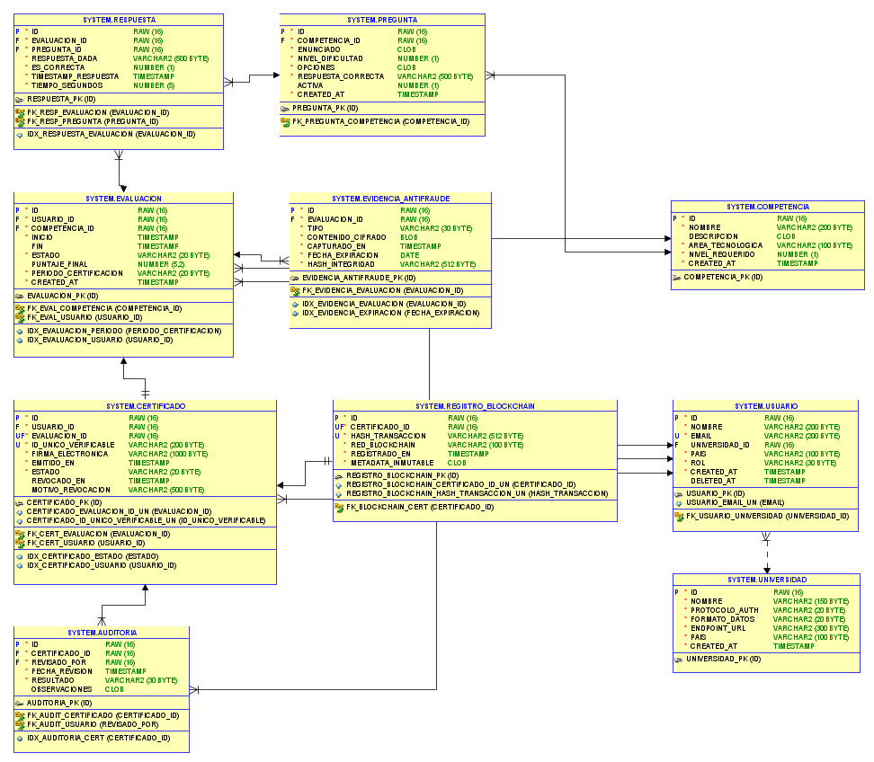

---

### 8.2 Justificación — soporte a auditoría y almacenamiento a largo plazo

#### Entidades del modelo y su justificación

| Tabla | Justificación resumida |
|---|---|
| `UNIVERSIDAD` | Soporta LDAP, SAML y OAuth2 para USAC, UCR y UES |
| `USUARIO` | Gestiona candidatos con soft delete para derecho al olvido |
| `COMPETENCIA` | Define las competencias digitales certificables por área |
| `EVALUACION` | Controla sesiones adaptativas restringidas a la primera semana del mes |
| `PREGUNTA` | Banco de preguntas con nivel de dificultad para el motor adaptativo |
| `RESPUESTA` | Persiste cada respuesta con timestamp para trazabilidad anti-fraude |
| `EVIDENCIA_ANTIFRAUDE` | Almacena capturas, logs y video cifrados con retención de 5 años |
| `CERTIFICADO` | Emite credenciales con firma electrónica y validez transfronteriza |
| `REGISTRO_BLOCKCHAIN` | Bitácora inmutable en Hyperledger para garantizar no alteración |
| `AUDITORIA` | Rastro exigido por Ministerios con resultado y observaciones |

---

#### ¿Por qué relacional y no NoSQL?

| Criterio | Justificación técnica |
|---|---|
| **Transaccionalidad** | Las evaluaciones y certificados requieren cumplimiento estricto de propiedades ACID. |
| **Integridad Referencial** | Uso de Foreign Keys para garantizar que no existan certificados huérfanos o datos inconsistentes. |
| **Auditoría Inmutable** | Constraints y timestamps nativos que garantizan la trazabilidad total de los registros. |
| **Presupuesto** | Implementación sobre Oracle XE (Open Source/Free), cumpliendo el límite de USD 180,000. |

---

#### ¿Cómo soporta las necesidades de auditoría?

**`EVIDENCIA_ANTIFRAUDE`**
> *"retención inalterable por un período de 5 años para cumplir con el GDPR"*
- Campo `fecha_expiracion` controla automáticamente el ciclo de vida de la evidencia biométrica.
- Campo `hash_integridad` garantiza que el contenido cifrado no ha sido alterado desde su captura.

**`REGISTRO_BLOCKCHAIN`**
> *"bitácora inmutable que demuestre que ni la calificación ni la identidad han sido alteradas"*
- Campo `hash_transaccion` único e inmutable registrado en Hyperledger.

**`AUDITORIA`**
> *"rastro de auditoría inmutable respaldado por firmas electrónicas avanzadas"*
- Registra cada revisión con su resultado y observaciones, cumpliendo el requerimiento de los Ministerios de Trabajo y Direcciones Financieras.

---

#### ¿Cómo soporta el almacenamiento a largo plazo?

- **Derecho al olvido** → `USUARIO.deleted_at` permite soft delete sin romper la integridad referencial, *"garantizando el derecho al olvido"* exigido por el GDPR.
- **Retención 5 años** → `EVIDENCIA_ANTIFRAUDE.fecha_expiracion` controla automáticamente el ciclo de vida de la evidencia biométrica.
- **Rendimiento en picos** → 8 índices creados para soportar *"picos de tráfico agresivos con miles de usuarios simultáneos la primera semana de cada mes"*.

---

#### Flujo de datos del proceso principal

```
UNIVERSIDAD → USUARIO → EVALUACIÓN → RESPUESTA
                                ↓
                    EVIDENCIA_ANTIFRAUDE
                                ↓
              CERTIFICADO → REGISTRO_BLOCKCHAIN
                                ↓
                           AUDITORÍA
```

---
 
## 9. Diseño de Interfaces (UI/UX)
 
### 9.1 Prototipo: Acceso y Autenticación de Usuarios
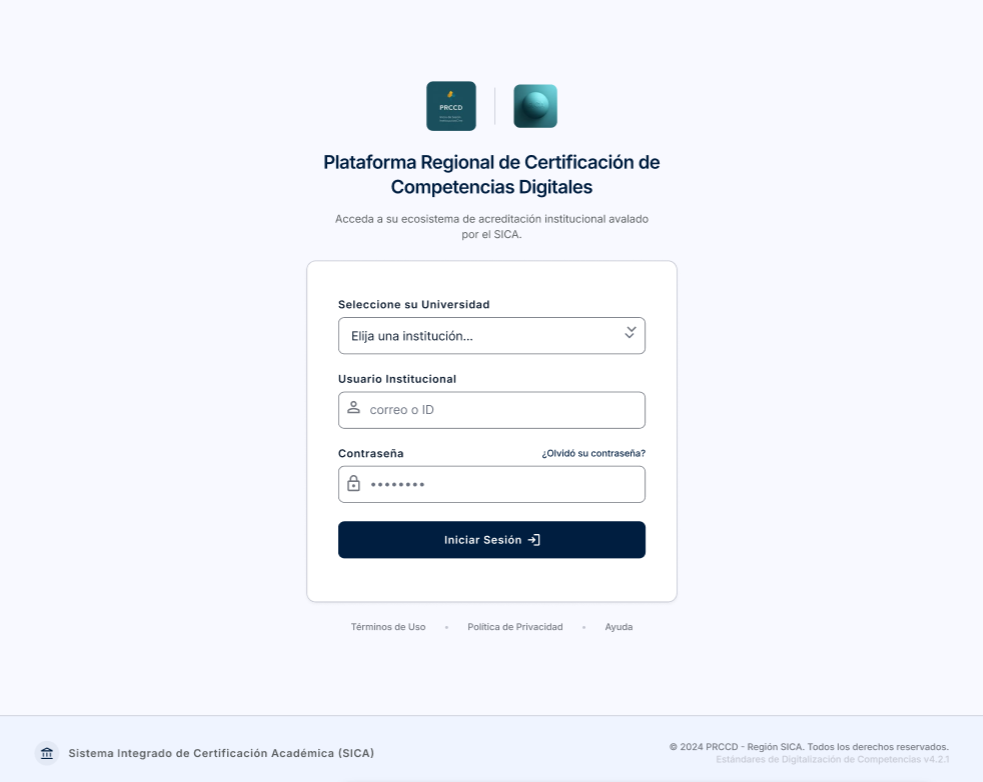
 
### 9.2 Prototipo: Panel Principal del Candidato
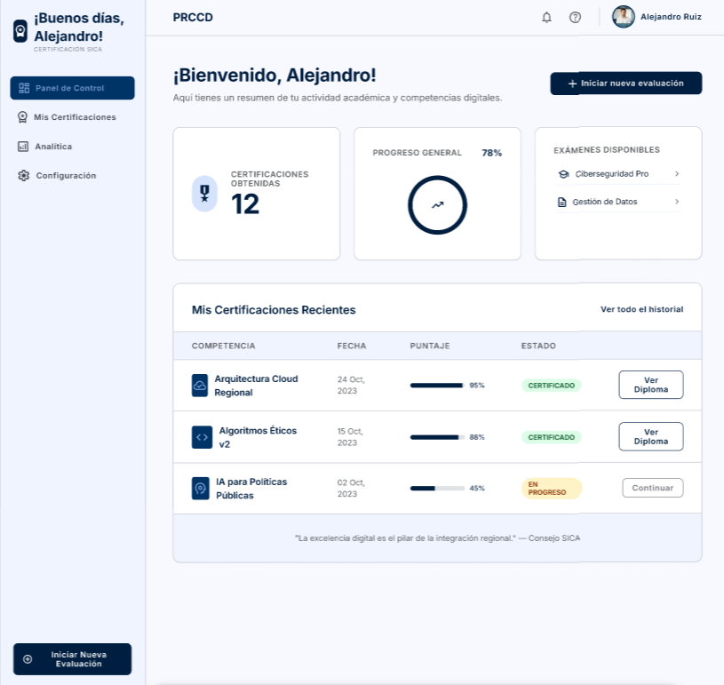

### 9.3 Prototipo: Evaluación Adaptativa de Competencias
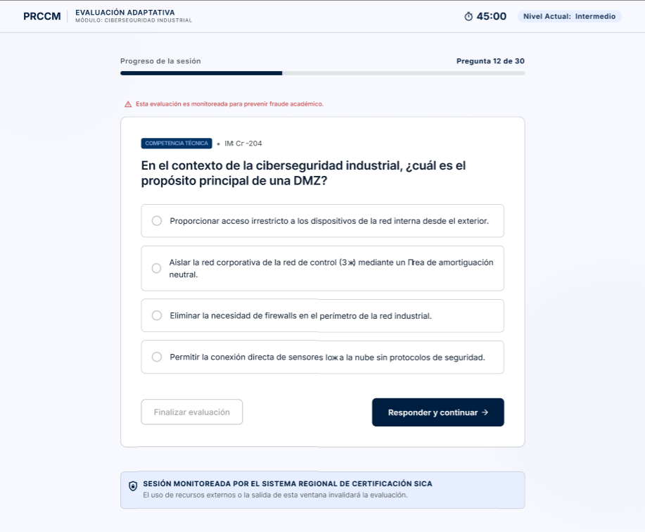
 
### 9.4 Prototipo: Gestión de certificados
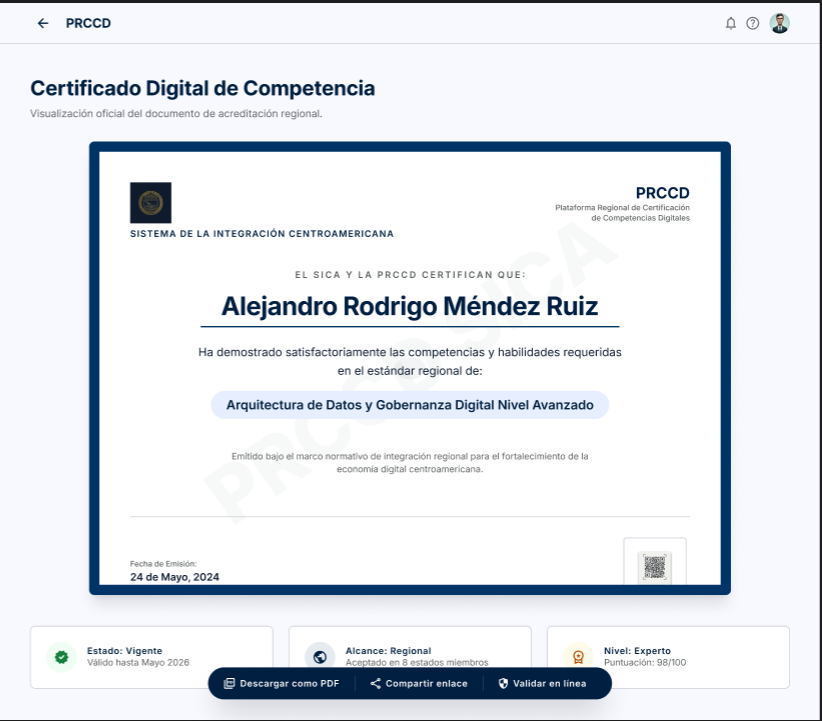


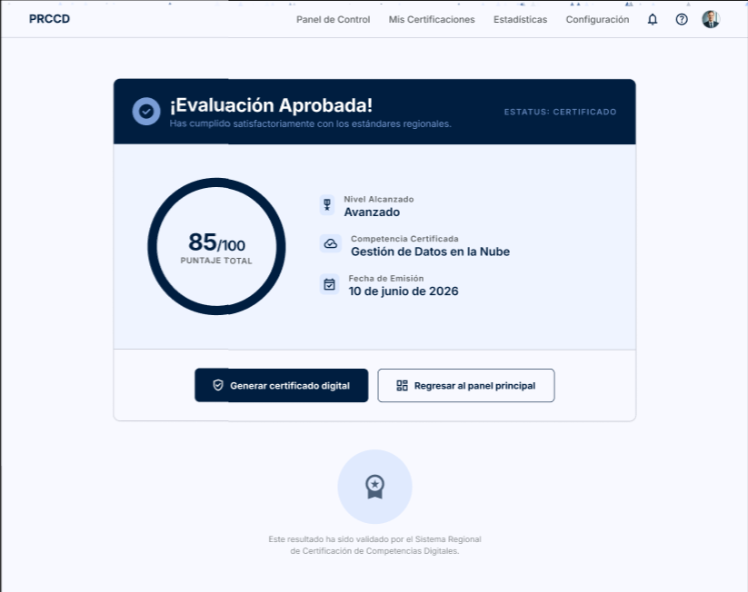

### 9.5 Prototipo: Dashboard analítico regional
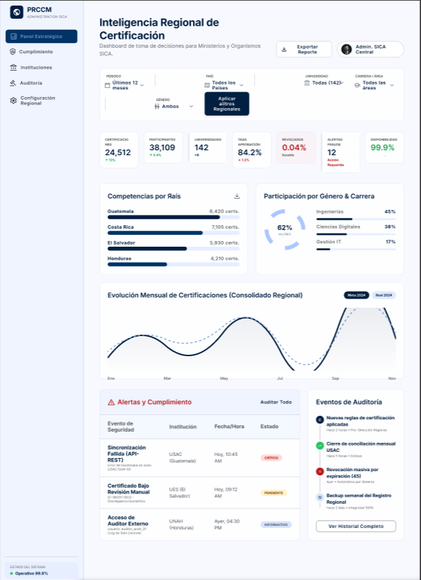
 
---
 
## 10. Patrones de Diseño
 
### 10.1 Patrón 1 — Adapter (Adaptador)

### Punto de aplicación
**Capa de Integración con Universidades (USAC, UCR, UES)**

La plataforma debe conectarse con sistemas que utilizan:

- LDAP
- SAML
- OAuth2
- JSON
- XML
- CSV

El patrón Adapter permite que todos esos sistemas sean consumidos mediante una interfaz común.


### UML     

```text
                    +----------------------+
                    | IUniversidadAdapter  |
                    +----------------------+
                    | autenticar()         |
                    | obtenerDatos()       |
                    +----------+-----------+
                               ^
          +--------------------+--------------------+
          |                    |                    |
          |                    |                    |
+----------------+   +----------------+   +----------------+
| LDAPAdapter    |   | SAMLAdapter    |   | OAuthAdapter   |
+----------------+   +----------------+   +----------------+
| autenticar()   |   | autenticar()   |   | autenticar()   |
| obtenerDatos() |   | obtenerDatos() |   | obtenerDatos() |
+-------+--------+   +-------+--------+   +--------+-------+
        |                    |                    |
        v                    v                    v
   Sistema LDAP        Sistema SAML       Sistema OAuth2
```

### Justificación

Cada universidad expone mecanismos distintos de autenticación e intercambio de datos.

El patrón Adapter:

- evita modificar los sistemas externos;
- desacopla la PRCCD de tecnologías específicas;
- facilita incorporar nuevas universidades.
 
### 10.2 Patrón 2 — Strategy (Estrategia)

### Punto de aplicación

**Motor de Exámenes Adaptativos**

La dificultad de las preguntas cambia según el desempeño del candidato.

Cada algoritmo de adaptación puede implementarse como una estrategia diferente.

### UML

```text
                 +----------------------+
                 | DifficultyStrategy   |
                 +----------------------+
                 | calcularSiguiente()  |
                 +----------+-----------+
                            ^
        +-------------------+------------------+
        |                   |                  |
        |                   |                  |
+----------------+ +----------------+ +----------------+
| EasyStrategy   | | MediumStrategy | | HardStrategy   |
+----------------+ +----------------+ +----------------+
| calcular()     | | calcular()     | | calcular()     |
+----------------+ +----------------+ +----------------+

                 +----------------------+
                 | ExamEngine           |
                 +----------------------+
                 | strategy             |
                 +----------------------+
                 | evaluarRespuesta()   |
                 +----------------------+
```

### Justificación

Permite cambiar el algoritmo de evaluación sin modificar el motor principal.

Beneficios:

- flexibilidad;
- extensibilidad;
- mantenimiento sencillo.
 
### 10.3 Patrón 3 — Factory Method

### Punto de aplicación

**Generación de Certificados Digitales**

La plataforma puede emitir diferentes tipos de certificados:

- Certificado académico
- Certificado profesional
- Certificado regional
- Certificado blockchain

### UML

```text
                    +------------------+
                    | Certificate      |
                    +------------------+
                    | generar()        |
                    +--------+---------+
                             ^
        +--------------------+--------------------+
        |                    |                    |
        |                    |                    |
+----------------+  +----------------+  +----------------+
| AcademicCert   |  | Professional   |  | BlockchainCert |
+----------------+  +----------------+  +----------------+
| generar()      |  | generar()      |  | generar()      |
+----------------+  +----------------+  +----------------+

              +------------------------+
              | CertificateFactory     |
              +------------------------+
              | crearCertificado()     |
              +-----------+------------+
                          |
                          v
                    Certificate
```

### Justificación

La lógica de creación queda centralizada.

Beneficios:

- desacopla la creación del uso;
- facilita agregar nuevos tipos de certificación;
- mejora mantenibilidad.

 
### 10.4 Patrón 4 — Observer (Observador)

### Punto de aplicación

**Monitoreo, Auditoría y Notificaciones**

Cuando ocurre un evento relevante:

- examen aprobado;
- examen reprobado;
- certificado emitido;
- intento sospechoso de fraude;

varios módulos deben reaccionar automáticamente.

### UML

```text
                +--------------------+
                | Subject            |
                +--------------------+
                | attach()           |
                | detach()           |
                | notify()           |
                +---------+----------+
                          ^
                          |
                +---------+----------+
                | ExamEventManager   |
                +--------------------+

                          |
          ---------------------------------------
          |                 |                  |
          v                 v                  v

+----------------+ +----------------+ +----------------+
| AuditObserver  | | EmailObserver  | | DashboardObs.  |
+----------------+ +----------------+ +----------------+
| update()       | | update()       | | update()       |
+----------------+ +----------------+ +----------------+
```

### Justificación

Un mismo evento genera múltiples acciones.

Permite:

- registrar auditorías;
- enviar notificaciones;
- actualizar dashboards;

sin acoplar los componentes.

 
### 10.5 Patrón 5 — Singleton

### Punto de aplicación

**Servicio Central de Auditoría Inmutable**

La bitácora de auditoría debe ser única y consistente para toda la plataforma.

### UML

```text
                +----------------------+
                | AuditManager         |
                +----------------------+
                | instance             |
                +----------------------+
                | getInstance()        |
                | registrarEvento()    |
                +----------+-----------+
                           |
                           |
                     única instancia
```

### Justificación

La auditoría es un recurso compartido y crítico.

Beneficios:

- única fuente de verdad;
- evita inconsistencias;
- facilita trazabilidad y cumplimiento normativo.
 
---
 
## 11. Gestión del Proyecto (Enfoque Ágil)
 
### 11.1 Tablero Kanban

El proyecto se gestiona mediante un tablero Kanban con el flujo de trabajo: **To Do → Blocked → In Progress → Ready for Testing → Test/QA → Done**.

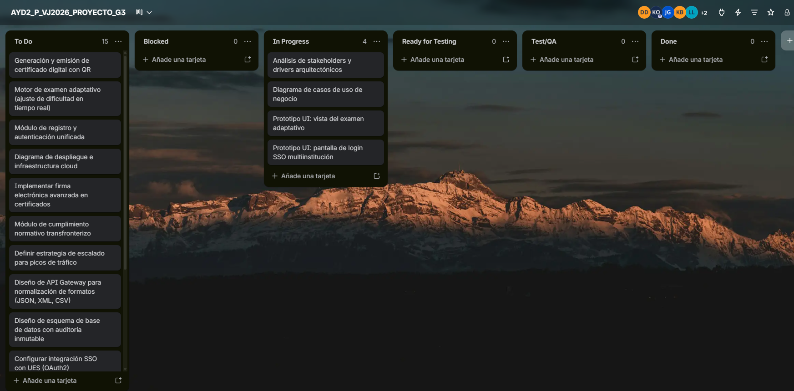

### 11.2 Backlog del proyecto (historias de usuario y tareas de desarrollo)

El detalle del backlog, con las tareas de desarrollo de la arquitectura organizadas por columna y categoría, se encuentra en:

📋 [Backlog del proyecto — Tablero Kanban PRCCD](documentación/kanban-backlog.md)
 
---
 